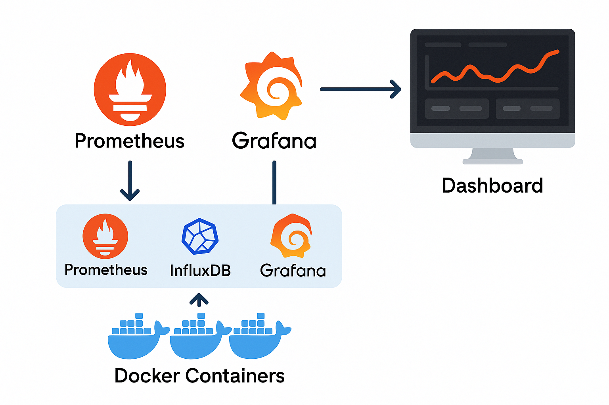
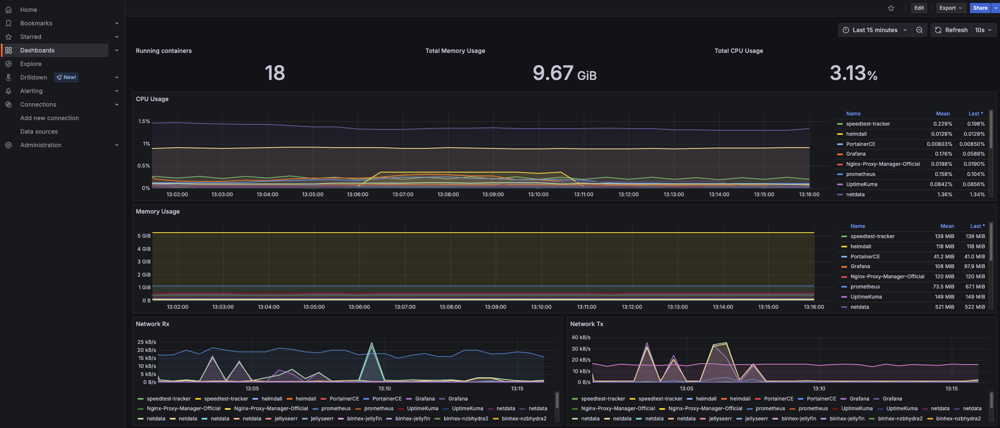
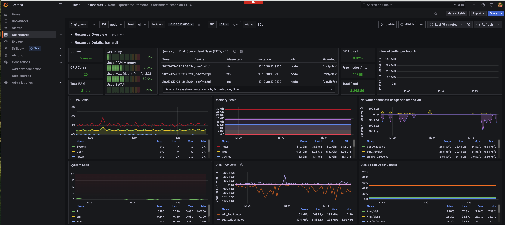

# 🏠 Homelab Monitoring – Observability with Prometheus + Grafana

## 🎯 Project Goal

A monitoring and observability stack for my homelab, built using Prometheus, Grafana, node_exporter, and cAdvisor. This project collects and visualizes real-time metrics for my Unraid server and Docker containers.

## 🏗️ Architecture Overview

👉 The observability stack consists of four main components running on your Unraid server:
	1.	node_exporter collects system-level metrics (CPU, memory, disk, network) from the Unraid host.
	2.	cAdvisor collects Docker container metrics (container CPU/mem/disk/net usage).
	3.	Prometheus scrapes metrics from both node_exporter and cAdvisor at regular intervals.
	4.	Grafana queries Prometheus to visualize metrics through interactive dashboards.

✅ All components are deployed as Docker containers within Unraid.

✅ Grafana is configured to use Prometheus as its data source.

✅ Dashboards display both host-level and container-level metrics.

Optional future integrations: Loki + Promtail for logs; Pi-hole metrics exporter.

## 📝 Technologies Used

- Prometheus
- Grafana
- node_exporter
- cAdvisor
- Docker
- Unraid

## 🔄 Metrics Monitored

- System CPU, memory, disk, network
- Docker container CPU, memory, I/O, network
- Uptime and container health

## 🚀 Deployment Overview

1. Prometheus scrapes metrics from node_exporter and cAdvisor
2. Grafana visualizes metrics via dashboards
3. Docker containers deployed directly in Unraid’s Docker engine
4. Optional dashboards imported from Grafana’s dashboard repository

## 🖥️ Example Dashboards

## 📚 Documentation

- Prometheus config: [prometheus.yml](docs/prometheus.yml)
- UnRaid Dashboard JSON exports: [unraiddash.json/](docs/dockerdash.json)
- Container Dashboard JSON exports: [containerdash.json/](docs/containerdash.json)

## 🔭 Future Enhancements

- Add Loki + Promtail for log aggregation
- Add alerting to Grafana dashboards
- Explore integration with Pi-hole DNS logs

## 🔗 Related Projects

Explore more of my infrastructure and automation projects:

🔹 [Homelab 2025](https://github.com/sgersz/homelab-2025): A secure, scalable home lab infrastructure combining virtualization, containerization, automation, and Zero Trust networking.

🔹 [Homelab Monitoring](https://github.com/sgersz/observability-dashboard): Monitoring stack using Prometheus, Grafana, node_exporter, and cAdvisor to visualize system and Docker metrics in real time.

🔹 [Workspace Cost Reduction](https://github.com/sgersz/-workspacecostreduction): Cloud cost optimization project migrating from AWS Workspaces to EC2 + Zscaler ZPA, reducing per-user costs by 35%.

🔹 [Simple CI/CD Pipeline](https://github.com/sgersz/simplecicd): Demo repo automating Docker builds for a Flask app using GitHub Actions.

## 🚀 **Connect with me**

